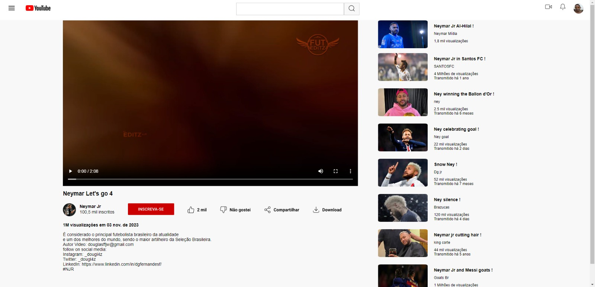

# Desafio 02: Criando um Clone do Youtube com HTML e CSS

Bem vindo(a) ao meu segundo desafio da Trilha de CSS da DIO! Nela, eu construir uma Landing Page do Youtube com HTML e CSS, colocando em prática os fundamentos do CSS, e principalmente ulisando o Flexbox
as propriedades básicas da linguagem de estilização, que aprendemos ao longo da trilha. Não está responsivo.

[Clique aqui](https://douglasffjw.github.io/loginPage_Youtube/) para acessar o resultado final da Landing Page criada a partir do desafio!

## 🛠 Tecnologias

- HTML
- CSS 

# 📞Contato
 
> Email: douglasfernandesti@gmail.com

> Whatsapp: (85) 989712043 

> Insta: @_dougl4z

